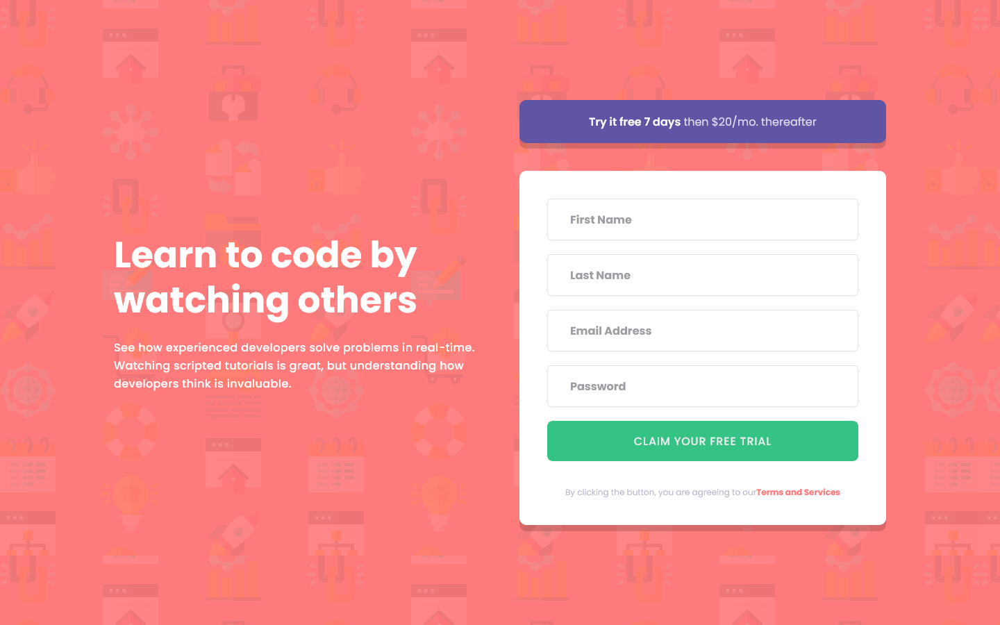

# Frontend Mentor - Intro component with sign up form solution

This is a solution to the [Intro component with sign up form challenge on Frontend Mentor](https://www.frontendmentor.io/challenges/intro-component-with-signup-form-5cf91bd49edda32581d28fd1). Frontend Mentor challenges help you improve your coding skills by building realistic projects. 

## Table of contents

- [Overview](#overview)
  - [The challenge](#the-challenge)
  - [Screenshot](#screenshot)
  - [Links](#links)
- [My process](#my-process)
  - [Built with](#built-with)
  - [What I learned](#what-i-learned)
- [Author](#author)

## Overview

### The challenge

Users should be able to:

- View the optimal layout for the site depending on their device's screen size
- See hover states for all interactive elements on the page
- Receive an error message when the `form` is submitted if:
  - Any `input` field is empty. The message for this error should say *"[Field Name] cannot be empty"*
  - The email address is not formatted correctly (i.e. a correct email address should have this structure: `name@host.tld`). The message for this error should say *"Looks like this is not an email"*

### Screenshot




### Links

- Solution URL: [https://github.com/Akiz-Ivanov/intro-component-with-signup-form](https://github.com/Akiz-Ivanov/intro-component-with-signup-form)
- Live Site URL: [https://akiz-ivanov.github.io/intro-component-with-signup-form/](https://akiz-ivanov.github.io/intro-component-with-signup-form/)

## My process

### Built with

[](https://react.dev/)
[](https://www.typescriptlang.org/)
[](https://tailwindcss.com/)

#### Core Technologies
- [React](https://react.dev/) - Frontend library
- [TypeScript](https://www.typescriptlang.org/) - Type checking
- [Tailwind CSS](https://tailwindcss.com/) - Utility-first CSS
- [ShadCN/ui](https://ui.shadcn.com/) - UI components
- [Sonner](https://sonner.emilkowal.ski/) - Toast notifications

#### Form Handling
- [React Hook Form](https://react-hook-form.com/) - Form management
- [Zod](https://zod.dev/) - Schema validation

#### Tooling
- [Vite](https://vitejs.dev/) - Build tool
- [npm](https://www.npmjs.com/) - Package manager

#### Design
- [Frontend Mentor](https://www.frontendmentor.io/) - Challenge platform


### What I learned

This project gave me valuable hands-on experience with several modern technologies:

#### TypeScript
- Implemented **type-safe form handling** with Zod schemas
- Practiced **interface design** for form data and props
- Learned to **type complex component structures** in React

#### ShadCN/ui
- Customized **themable components** (form, button, inputs, toast)
- Integrated **accessible UI patterns** into the form

#### React Hook Form + Zod
- Built **performant forms** with minimal re-renders
- Created **custom validation rules** with Zod schemas:
```ts
  const formSchema = z.object({
    firstName: z.string().nonempty("First name cannot be empty").min(2, "First name must be at least 2 characters").max(30),
    lastName: z.string().nonempty("Last name cannot be empty").min(2, "Last name must be at least 2 characters").max(30),
    email: z.string().nonempty("Email cannot be empty").email("Looks like this is not an email"),
    password: z.string().nonempty("Password cannot be empty").min(6, "Password must be at least 6 characters"),
})
```

## Author

- Frontend Mentor - [@Akiz97](https://www.frontendmentor.io/profile/Akiz97)
- GitHub - [@Akiz-Ivanov](https://github.com/Akiz-Ivanov)